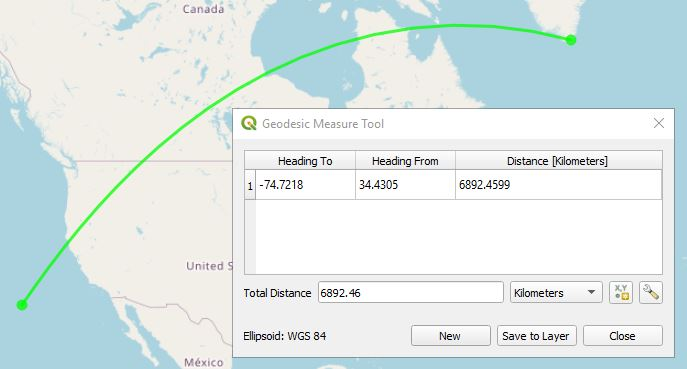

# QGIS Shape Tools Plugin

***Shape Tools*** has the following tools that are installed in the Vector menu or can be accessed from the toolbar.

*  **Create Shapes** processes a point vector layer to create ellipses, lines of bearing, pie wedge, polygons, stars, ellipse roses, hypocyloids, polyfoils, epicyloids, and hearts based on the table's fields and parameters from the dialog box. All use geodesic math to calculate the shapes. 
*  **XY to Line** uses pairs of coordinates from each layer's records to create geodesic lines in between. Geodesic lines represent the shortest path along the Earth's surface between two points. The input can be a point vector layer or a table layer that contains pairs of coordinates. 
*  **Geodesic Line Densifier** densifies a line vector layer by either drawing a geodesic line between the beginning and ending points or by adding geodesic points in between each line segment whenever the distance between vertices exceeds a certain threshold. This creates a geodesic path to give it a nice smooth curved appearance.
*  **Geodesic Polygon Densifier** processes a polygon vector layer and insert vertices so that all polygon edges follow a geodesic path.
*  **Geodesic Measure Tool** provides geodesic line measuring, similar to that implemented in Google Earth.

**Contents**

* [Create Shapes](#create-shapes)
* [XY to Line](#xy-to-line)
* [Geodesic Line Densifier](#geodesic-line-densifier)
* [Geodesic Polygon Densifier](#geodesic-polygon-densifier)
* [Geodesic Measure Tool](#geodesic-measure)
* [Settings](#settings)

##   Create Shapes

Ellipses, lines of bearing, pie wedges, multi-sided polygons, stars, ellipse roses, hypocycloids, polyfoils, epicycloids, and hearts can be created from parameters in the layer data or from default parameters in the *Create Shapes* tool. The following are the details for creating each. All of these shapes are created centered about the point or from the point. Common elements are:

* **Input points layer** - Select the desired points layer.
* **Output layer name** - Select a name for the output layer that will be created in QGIS as a memory layer.

### Ellipse

Select a points vector layer and an output layer name or use the default name. Then select the specific ellipse parameters. The semi-major axis of the ellipse runs along the orientation axis. The orientation the axis is measured in degrees in a clockwise direction from the north line. Units of measure for semi-major, and semi-minor lengths are defined by ***Axis units of measure***.

If a field in the layer represents the semi-major axis, semi-minor axis, or orientation of axis, then the field can be selected and the data from the layer will be used, otherwise the default values will be used.

### Line of Bearing

**Bearing** is the angle measured in degrees, in a clockwise direction from the north line. A **line of bearing** is the line drawn from a starting point in the direction of the **bearing** for the selected distance. The line of bearing uses geodesic math to find the shortest path and is accurate along the Earth's surface. 

### Pie Wedge

The pie wedge focal point starts at the point layer's geometry extending out to the specified radius. It starts at the **Starting bearing** going in a clockwise direction to the **Ending bearing**. The pie wedge can either be defined from the point vector layer data fields or from the **Default** parameters.

### Polygon

Create an N-sided polygon centered on the vector point. The vertices of the polygon lie on a circle of the default radius.

### Star

Create an N-pointed star with the outer vertices located on a circle defined by the outer radius. The inner vertices are located along the circle defined by the inner radius. One of the radius' can be negative which gives an interesting shape.

### Ellipse Rose

Create an N-petal rose. The distance from the center to the outer petals are defined by the radius.

### Hypocycloid

Create an N-pointed hypocycloid. A hypocycloid is defained as the curve traced by a point on the circumference of a circle that is rolling on the interior of another circle. The distance from the center to the outer cusps are defined by the radius.

### Polyfoil

Create an N-leafed polyfoil. The distance from the center to the outer leafs are defined by the radius.

### Epicycloid

Create an N-leafed epicycloid. The distance form the center to the outer edge is defined by the radius.

### Heart

Create a mathematical heart which fits within the circle defined by its radius.

##   XY to Line
This creates geodesic lines based on starting and ending coordinates in each table record. One of the coordinates can be from a point layer geometry or both can come from the table data itself where each record has a start x-coordinate, start y-coordinate, and an end x-coordinate and end y-coordinate.

**Input Layer** - This can either be a points layer of a simple table. For example a CSV file containing starting and ending coordinates could be imported using the importer ***Add Delimited Text Layer...*** from the menu ***Layer->Add Layer->Add Delimited Text Layer...*** From this dialog box the user can specify one of the coordinates for the layer's geometry or **No Geometry** can be used. Both types of layers will be visible to **XY to Line.**

**Output Points Layer Name** - Name of the points layer that will be created in QGIS. It is automatically generated from the **Input Layer** name. It can contain the starting point, ending point, both points, or no points in which case it will not be created. 

**Output Line Layer Name** - Name of the line layer that will be created in QGIS. It is automatically generated from the **Input Layer** name.

**Input Coordinate CRS** - CRS of the input coordinates. Note that if **Use the Layer's geometry** is specified this must match both the layer's geometry CRS as will as the table's data CRS.

**Output Layer CRS** - CRS of the output line and point layers.

**Line Type** - 1) **Geodesic** creates a highly accurate shortest path between two points. 2) **Great Circle** creates a *Great Circle* arc between the two points. 3) **Simple Line** creates a non-geodesic straight line between the two points. 

**Starting Point** - Specify whether to use the *Layer's geometry* (not available for tables) or to specify the **Start X Field** and **Start Y Field** from the layer's fields.

**Ending Point** - Specify whether to use the *Layer's geometry* (not available for tables) or to specify the **End X Field** and **End Y Field** from the layer's fields.

**Show Starting Point** - If checked the output point layer will include an entry for the starting point.

**Show Ending Point** - If checked the output point layer will include an entry for the ending point.

If neither *Show Starting Point* nor *Show Ending Point* are checked, then a point layer will not be created.

##   Geodesic Line Densifier

Densify a line vector layer by either drawing a geodesic line between the beginning and ending points or add geodesic points in between each line segment where the distance is too great. This gives it a nice smooth curved appearance. The distance between two points before adding additional vertices is set from the **Settings** menu.

* **Input Layer** - Select an existing line layer.
* **Output Layer Name** - Specifies the name of the memory layer that will be created in QGIS.
* **Discard inner vertices of the line and just use end points** - When this is checked only the beginning and ending points are used when drawing geodesic lines.

##   Geodesic Polygon Densifier

This processes a polygon vector layer and inserts additional vertices along a geodesic path in line segments that are too long. The distance between two points before adding additional vertices is set from the **Settings** menu.

* **Input Layer** - Select an existing polygon layer.
* **Output Layer Name** - Specifies the name of the memory layer that will be created in QGIS.

The following shows the before and after results of running this function.

##   Geodesic Measure Tool

This provides the ability to measure distances using geodesic (shortest path) algorithms. The results returned are the same as those used by Google Earth and makes for a nice baseline of distances. It also includes the heading from the first point to the second and a heading from the second point to the first. The units are in degrees. The units of distance can be meters, kilometers, feet, yards, miles, and nautical miles. Simply click on the ***Geodesic Measure Tool*** icon and start clicking on the map. 

## Settings

The settings dialog box can be accessed from the Shape Tools menu *Vector->Shape Tools->Settings*. The following are the parameters that can be configured.

* **Try to guess column names** - By default the ellipse and line of bearing shapes will try to guess the vector fields that contain the appropriate parameters such as semi-major axis, semi-minor axis, axis orientation, bearing, and distance. If it finds one of the fields that has a name similar to these it will set the drop down menu to that item. If you do not want this behavior, then uncheck this box.
* **Line Settings** - These are settings when drawing geodesic and great circle lines.
    * **Maximum segment length before creating a new segment** - In order to draw a smooth curved line, multiple line segments are required. This defines how far to travel before a new line segment is created. This parameter is in kilometers. 
    * **Maximum number of segments per line** - This is the maximum number of line segments that will be created for any line even though it may exceed the maximum segment length. This takes precedence.
