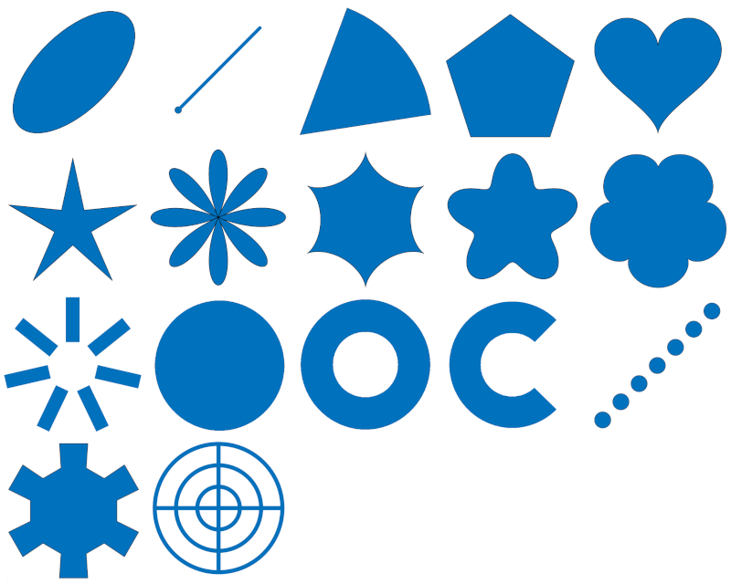
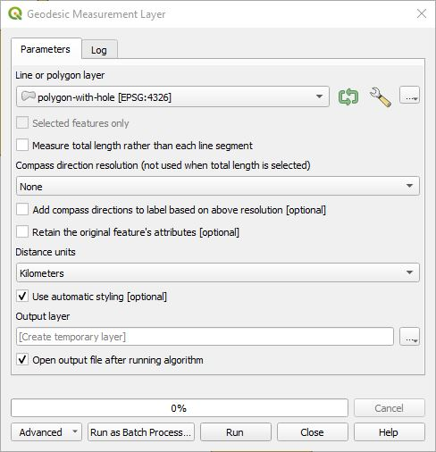
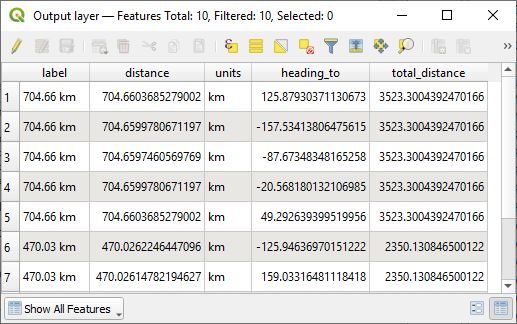

# QGIS Shape Tools Plugin

***Shape Tools*** is a collection of geodesic tools that are installed in the Vector menu, on the toolbar, in the field calculator, or in the Processing Toolbox. Geodesic is the shortest path between two points on the Earth, a spheroid, or an ellipsoid. 

*  **Create geodesic shapes** processes a point vector layer to create circles, ellipses, lines of bearing, pie wedges, donuts, arc wedges, polygons, stars, ellipse roses, hypocyloids, polyfoils, epicyloids, radial lines, concentric rings with radial lines, and hearts based on the table's fields and parameters from the dialog box. All use geodesic math to calculate the shapes. 
*  **Interactive geodesic shapes** allows the user to click on the map and capture its coordinate to create concentric rings with radial lines or donuts centered around the coordinate. All use geodesic math to calculate the shapes. 
*  **XY to Line** uses pairs of coordinates from each layer's records to create geodesic lines in between. The input can be a point vector layer or a table layer that contains pairs of coordinates.
*  **Geodesic line break at -180,180** breaks lines at the International Date Line at -180,180 degrees longitude for a more pleasing visual look.
*  **Geodesic densifier** densifies a line or polygon vector layer by adding geodesic points in between each line segment whenever the distance between vertices exceeds a certain threshold. This creates a geodesic path that gives it a nice smooth curved appearance. If the vector layer is a line, it can also draw a geodesic line just between the beginning and ending points.
*  **Geodesic line decimate** removes vertices in a line that who's geodesic distance is less than a certain value.
*  **Geodesic point decimate** removes points in a point layer who's geodesic distance is less than a certain value or who's time difference between points is less than a certain value.
*  **Geodesic measure tool** provides geodesic line measuring, similar to that implemented in Google Earth.
*  **Geodesic measurement layer** converts a polygon or line layer a new layer with all geometries measured and labeled.
*  **Geodesic transformations** can geodesically scale, rotate, and translate points, lines and polygons. Each vector feature retains their relative dimensions no matter what the projection is.
*  **Geodesic flip & rotate tools** provide the following geodesic vector transformations: Flip horizontally, flip vertically, rotate by 180 degrees, rotate clockwise by 90 degrees, and rotate counter clockwise by 90 degrees.
*  **Azimuth, distance digitizer** creates a new point at a certain azimuth/bearing and distance or creates a geodesic line from the point clicked to a point in the azimuth direction located at a distance.
*  **Azimuth distance sequence digitizer** digitizes a sequence of azimuth/bearing, distance pairs to create a series of points, a line, or a polygon.

* **Field Calculator Expression Functions**
    * st_compass() - Returns the cardinal or compass direction given an azimuth as a string.
    * st_from_meters() - Convert a length in meters to another unit.
    * st_to_meters() - Convert a length to meters.
    * st_geodesic_bearing() - Returns the geodesic azimuth starting from the first coordinate in the direction of the second coordinate.
    * st_geodesic_distance() - Returns the geodesic distance in meters between two coordinates or two geometry points.
    * st_geodesic_transform() - Geodesically transfrom a shape (point, line, polygon) using rotation, translation, and scaling.

## Contents

* [Create Geodesic Shapes](#create-shapes)
* [Interactive Geodesic Shapes](#interactive-shapes)
* [XY to Line](#xy-to-line)
* [Geodesic Line Break](#geodesic-line-break)
* [Geodesic Densifier](#geodesic-densifier)
* [Geodesic Line Decimate](#geodesic-line-decimate)
* [Geodesic Point Decimate](#geodesic-point-decimate)
* [Geodesic Measure Tool](#geodesic-measure)
* [Geodesic Measurement Layer](#geodesic-measure-layer)
* [Geodesic Transformations](#geodesic-transformations)
* [Geodesic Flip and Rotate Tools](#geodesic-flip)
* [Azimuth, Distance Digitizer](#azimuth-distance)
* [Azimuth Distance Sequence Digitizer](#azimuth-distance-sequence)
* [Field Calculator Expression Functions](#expressions)
* [Settings](#settings)

##   Create Geodesic Shapes

All of these shapes can be accessed from the ShapeTools processing algorithms.

They can also be accessed from the *Vector->Shape Tools->Create geodesic shapes* menu.

The various shapes can be created from the feature's attributes or from default parameters in the *Create Shapes* tool. Note that if the output layer uses a temporary layer, it will not be saved with the QGIS project. You need to manually save the layer or use the [Memory Layer Saver](http://plugins.qgis.org/plugins/MemoryLayerSaver/) plugin.

The following are details for creating each shape. All of the shapes are created centered around a point feature or from a point feature. Common elements are:

* **Input layer** - Select the desired point vector layer.
* **Output layer** - Select one of ***[Create Temporary Layer]***, ***Save to file...***, ***Save to GeoPackage...***, or ***Save to Database Table...***.
* **Shape Type** - Specify whether the shape should be drawn as a polygon or as a line.
* **Add input geometry fields to output table** - If checked, the input point geometry will be added to fields in the output shape table. By default these fields are named ***geom_x*** and ***geom_y***, but can be changed in **Settings**.

### Ellipse

Select a point vector layer and an output layer or use the default temporary output layer. Then select the specific ellipse parameters. The semi-major axis of the ellipse runs along the orientation axis. The orientation of axis is measured in degrees in a clockwise direction from the north line. The units of measure for semi-major, and semi-minor lengths are defined by ***Radius units***.

To the right of the semi-major axis, semi-minor axis, and orientation of axis entries are data defined override buttons . These fields allow the values to be derived from the contents in the attribute table as shown here.

Alternatively, the user can click on the ***Edit...*** button and use any valid expression.

### Line of Bearing

A **line of bearing** is the line drawn from a starting point in the direction of the **asimuth** or **bearing** for the specified distance. The line of bearing uses geodesic math to find the shortest path and is accurate along the Earth's surface.

* **Azimuth/bearing** is the angle measured in degrees, in a clockwise direction from the north line.
* **Distance** - The line will be drawn from the originating point plus the offset in the **azimuth** direction until it reaches this distance from the origin.
* **Line offset from origin** - In some instances you may only be interested in distances away from the point of origin. This parameter allows the user to start the line at some offset distance from the origin.
* **Distance units** - The unit of distance measurements of the above parameters.

### Points Along a Bearing

A **line of bearing** is the line drawn from a starting point in the direction of the **azimuth** or **bearing** for the specified distance. The line of bearing uses geodesic math to find the shortest path and is accurate along the Earth's surface. In this algoirthm rather than drawing a line, equally spaced points are created along the line.

* **Azimuth/bearing** - This is the angle measured in degrees, in a clockwise direction from the north line.
* **Distance** - This is the distance in which points will be drawn.
* **Distance from origin to the first point** - In some instances you may only be interested in distances away from the point of origin. This parameter allows the user to start the points at some offset distance from the origin.
* **Distance between points** - This is the stepping distance between rendered points. The value must be greater than 0.
* **Distance units** - The unit of distance measurements of the above parameters.

### Arc wedge

In essence this takes a wedge of a donut shape. The parameters are similar to **Pie wedge** and **Donut**.

### Circle

Create a circle shape. The circle radius is specified from the default value, from the attribute table, or from an expression. **Number of drawing segments** defines how many line segments it uses to create the circle. A larger value will produce a smoother circle, but will take more time to draw.

### Donut

Create a donut shape. The inner and outer radius are specified from the default values, from the attribute table, or expression. If the inner radius is 0 then a solid circle is drawn. **Number of drawing segments** defines how many line segments it uses to create the circle. A larger value will produce a smoother circle, but will take more time to draw.

### Ellipse Rose

Create an N-petal rose. The distance from the center to the outer petals are defined by the radius.

### Epicycloid

Create an N-leafed epicycloid. The distance from the center to the outer edge is defined by the radius.

### Gear

Create an N-toothed shape that look like a gear.

### Heart

Create a mathematical heart which fits within the circle defined by its radius.

### Hypocycloid

Create an N-pointed hypocycloid. A hypocycloid is defined as the curve traced by a point on the circumference of a circle that is rolling on the interior of another circle. The distance from the center to the outer cusps are defined by the radius.

### Pie Wedge

If **Azimuth mode** it is set to *Use beginning and ending azimuths*, then the pie wedge focal point starts at the point layer's geometry extending out to the specified radius. It starts at the **Starting azimuth** going in a clockwise direction to the **Ending azimuth**. If **Azimuth mode** is set to *Use center azimuth and width*, then a center azimuth is specified which becomes the center of the pie wedge with an arc length of **Azimuth width**. The pie wedge can either be defined from the point vector layer and the selected parameters or the override to the right allows selection of an attribute to derive the values or an expression. **Drawing segments** is the number of line segments that would be used to draw a full circle. A wedge will use a proportionally smaller number of segments. Making this larger will give smoother results, but will be slower rendering the shapes. If the azimuth width is 360 degrees, the a donut is created.

### Polyfoil

Create an N-leafed polyfoil. The distance from the center to the outer leafs are defined by the radius.

### Polygon

Create an N-sided polygon centered on the vector point. The vertices of the polygon lie on a circle of the default radius.

### Radial lines

Create N-radial lines equally spaced around the point starting from the inner radius and extending out to the outer radius.

### Rings with radial lines

Create N-rings around a point. The number or rings, inner ring radius and distance between rings can be specified from the dialog box or from parameters in each feature. N-radial lines can be drawn from the center point to the outer ring.

### Star

Create an N-pointed star with the outer vertices located on a circle defined by the outer radius. The inner vertices are located along the circle defined by the inner radius. One of the radius' can be negative which gives an interesting shape.

##   Interactive Geodesic Shapes

The ***Interactive geodesic shapes*** algorithms allow the user to click on the map canvas to capture a coordinate and then generate a single shape as defined from the processing dialog box centered around the coordinate. So far there are two shapes that can be created. These can be accessed from the QGIS menu at *Vector->Shape Tools->Interactive geodesic shapes* or from the processing tool box like this.

*  **Interactive concentric rings** - This creates 'N' concentric rings about the specified coordinate with optional radial lines. Here is an example of the output.

*  **Interactive donut** - This creates a donut shape centered on the specified coordinate. If the inner radius is 0, it creates a circle.

##   XY to Line

This creates geodesic, great circle, or simple lines based on starting and ending coordinates in each table record. One of the coordinates can be from a point layer geometry or both can come from the attribute table data where each record has a starting x-coordinate, starting y-coordinate, and an ending x-coordinate and ending y-coordinate.

**Input Layer** - This can either be a point layer, a simple table, or any other vector data set that has two coordinates among its data fields. For example a CSV file containing starting and ending coordinates could be imported using ***Layer->Add Layer->Add Delimited Text Layer...*** located in the QGIS menu. From this dialog box the user can specify one of the coordinates for the layer's geometry or **No Geometry** can be used. Both types of layers will be visible to **XY to Line.**

**Output point layer** - Optional points layer that can be created in QGIS. It can contain the starting point, ending point, both points, or no points in which case it will not be created. 

**Output line layer** - Output line layer file that is created in QGIS.

**Input CRS for coordinates within the vector fields** - CRS of the input coordinates within the table data fields.

**Output layer CRS** - CRS of the output line and point layers.

**Line type** - 1) **Geodesic** creates a highly accurate shortest path between two points. 2) **Great Circle** creates a *Great Circle* arc between the two points. 3) **Simple Line** creates a non-geodesic straight line between the two points. 

**Starting point** - Specify whether to use the *Layer's point geometry* (not applicable for layers that don't have Point geometry) or to specify the **Starting X Field (lon)** and **Starting Y Field (lat)** from the layer's fields.

**Ending Point** - Specify whether to use the *Layer's geometry* (not applicable for layers that don't have Point geometry) or to specify the **Ending X Field (lon)** and **Ending Y Field (lat)** from the layer's fields.

**Show starting point** - If checked the output point layer will include an entry for the starting point if an **Output point layer** has been specified.

**Show ending point** - If checked the output point layer will include an entry for the ending point if an **Output point layer** has been specified.

**Break lines at -180, 180 boundary for better rendering** - Depending on the QGIS projection when lines cross the international date line, strange behavior may occur. Checking this box breaks the line at the -180, 180 boundary in a way that it displays properly.

This function can also be accessed from the **Processing Toolbox**.

##   Geodesic Line Break at -180,180

If you have ever created a geospatial masterpiece that has crossings across the International Date Line at a longitude of -180&deg;/180&deg; and it turned out like the image on the left, you are not alone.

**Geodesic line break** will break lines at the -180&deg;/180&deg; boundary along a geodesic path which is the shortest distance along the earth's surface between two points. The algorithm is very simple with just an input and output layer. The resulting output is shown in the above right side image. Depending on your data you may find it useful to also run the **Geodesic Densifier** on the data prior to this routine.

##   Geodesic Densifier

Densify a line or polygon vector layer by adding geodesic points in between individual line segments when its length is too great. This gives it a nice smooth curved appearance. For line vectors a geodesic line can be drawn between just the beginning and ending points.

* **Input Layer** - Select an existing line or polygon layer.
* **Output Layer** - Specifies the output layer that will be created in QGIS.
* **Discard inner vertices (lines only)** - When this is checked only the beginning and ending points are used when drawing geodesic lines. This does not apply to polygons.
* **Maximum line segment length (in kilometers)** - This is the maximum length of a line segment before a new vertex is added along the geodesic path. This value defaults to the length specified in the **Settings** menu.

The following shows the before and after results of running this function on a polygon layer.

This function can also be accessed from the **Processing Toolbox**.

##   Geodesic Line Decimate

This simplifies the geometry of a line layer by removing vertices who's distance to the previous vertex is less than the specified value. For each line, the geodesic distance is calculated between vertices and if the distance is less than the specified minimum distance then the vertex is deleted. This repeats until the distance threshold is exceeded. The only exception to this rule is if ***Preserve final vertex*** is selected in which case the final vertex is always saved.

The following shows the before and after results of running this funciton on a line layer.

**Parameters**

* **Input layer** - Select an existing line layer.
* **Output layer** - Specifies the output layer that will be created.
* **Preserve final vertex** - If checked then the final vertex will not be discarded. If the distance between the previous saved vertex and the final vertex is less than the minimum distance then the next to the last saved vertex will be deleted or if there are only two vertices left, than the distance between the first and final vertex may be less than the minimum distance.
* **Decimation minimum distance beween vertices** - Sprecifies the minimum distance between vertices. Distances less than this are deleted.
* **Distance units** - Specifies the units of measure for the "Decimation minimum distance betwee vertices."

##   Geodesic Point Decimate
This reduces the number of points within a point vector layer by using geodesic distances mesurements between points and/or the time interval between points. This assumes that the points are ordered or that there is a property field that specifies the order of the points. Poiint can also be grouped together based on an attributed in the table in which case points from each grouping are processed separately.

**Parameters**

* **Input point layer** - Select an existing line layer.
* **Output layer** - Specifies the output layer that will be created.
* **Point order field** - This specifies a field that defines the order of the points to be processed. A time field can be used with GPS data to order the points by the time they were acquired.
* **Preserve final point** - If checked then the final point in each group will not be discarded.
* **Remove points that are less than the minimum distance** - Enables geodesic distance decimation.
    * **Minimum distance beween points** - Sprecifies the minimum distance between points. Distances less than this are targeted for deletion.
    * **Distance units** - Specifies the units of measure for the geodesic minimum distance.
* **Remove points by minimum time interval** - Enables time decimation.
    * **Time field** - Select a DateTime field to use for time decimation. If time is specified as a string then the field will need to be converted to a DateTime fields.
    * **Minimum time between points** - Points not meeting the minimum time difference are removed.
    * **Time units** - Specifies the time units of the above value. The units of time can be ***Seconds***, ***Minutes***, ***Hours***, and ***Days***.
* **When both decimate by distance and time are selected, preserve points if** - This specifies whether both distance and time requements must be met or only one or the other requirements are met.

##   Geodesic Measure Tool

This provides the ability to measure distances using geodesic (shortest path) algorithms. The results returned are similar to those used by Google Earth and makes for a nice baseline of distances. It also includes the heading from the first point to the second and a heading from the second point to the first. The units are in degrees. The units of distance can be kilometers, meters, centimeters, miles, yards, feet, inches, and nautical miles. Simply click on the ***Geodesic Measure Tool*** icon and start left-mouse clicking on the map to get measurements between points. A right-mouse click or ESC key press will end the measurement. Notice that the ellipsoid used to calculate measurements is listed in the lower left-hand corner. By default this is set to ***WGS 84***, but it can be changed in the ***Settings*** menu. If snapping is enabled, then the ***Geodesic Measure Tool*** will snap to vector layer vertices and features when the mouse hovers over them.

While using the geodesic measure tool the user can quickly copy values of the last heading to, heading from, distance, and total distance onto the clipboard by typing one of the following keys:

* **1 or T** - Copies the most recent 'Heading to' value onto the clipboard.
* **2 or F** - Copies the most recent 'Heading from' value onto the clipboard.
* **3 or D** - Copies the most recent 'Distance' value onto the clipboard.
* **4 or A** - Copies the 'Total distance' value onto the clipboard.

The number of significant decimal digits of the value copied onto the clipboard is determined in the ***Settings***.

The **Save to Layer** button will create a **Measurement** layer that contains the distance and by default the distance label will be displayed. The number of significant digits used for the label can be configured in ***Settings***.

By right-mouse clicking on the **Measurement** layer and selecting **Open Attribute Table,** the following attributes are available for each measured line segment; label, value, units, heading_to, heading_from, and the total distance for all line segments.

If **Points of the compass** settings are set to somthing other than **None**, then compass cardinal directions will be added to the **Geodesic measure tool** dialog box like this.

These attributes will also be saved when exporting by using the **Save to Layer** button.

By clicking on the ***Add measurement point*** icon , a new dialog windows is displayed were precise measurement points can be added. The coordinates can be in WGS 84 (EPSG:4326), the project CRS, or some other custom projection. In the drop down menus specify the projection and the coordinate order in which the coordinates are entered.

##   Geodesic Measurement Layer

This takes a polygon or line layer and measures the geodesic distances of each line segment in the lines or polygons or the total distance of all line segments in the shape's geometry. The user can choose whether each line segment is measured or the entire line/polygon geometry is measured. It creates a new line layer of line segments that contain attributes of all the measurements. If **Measure total length rather than each line segment** is checked, only the total distance is reported and the attributes are: label, distance, and units of measure. If measuring individual line segments, the attributes are: label, distance, units of measure, azimuth/bearing to the next point, and total distance of the geometry. If **Compass direction resolution** is not ***None***, then the following attributes are added: compass abbreviated cardinal direction, compass name, and compass traditional name. If the total length check box is unchecked and a value other than ***None*** is selected for **Compass direction resolution** and **Add compass directions to label based on above resolution** is checked, compass cardinal directions are added to the ***label*** attribute. **Distance units** can be kilometers, meters, centimeters, miles, yards, feet, inches, or nautical miles. **Use automatic styling** styles the QGIS layer with the label string in the attribute table and with the text and line colors found in **Settings**. Select the checkbox for **Retain the original feature's attributes** if you want the original attributes included in the output layer; otherewise, only the calculated measurements will be included.

Here is an example of running this on a polygon. Notice how it measures both the outer boundary and the inner boundary.

Here is what the attributes table looks like.

If **Compass direction resolution** is not **None** and **Measure total length rather than each line segment** is not checked, then additional compass cardinal direction atttibutes will be added. Here is what the attributes table looks like with **Compass direction resolution** is set to **16 point**.

##   Geodesic Transformations Tool

This tool provides the ability to geodesically transform a shape. It supports scaling, rotation and translation. Each of these can use data defined override expressions. The relative size and geometry of each shape will be retained regardless of the projection. 

* **Input layer** - Select an existing point, line, or polygon vector layer.
* **Selected features only** - Checking this box will cause the algorithm to only transform the selected features.
* **Rotation angle about the centroid** - Rotate the feature about its centroid. A positive angle rotates in a clockwise direction.
* **Scale factor about the centroid** - Scale the shape about its centroid. A scale factor of 1 retains its same size.
* **Translation distance** - Distance the shape will be moved along a geodesic path.
* **Translation azimuth** - Azimuth or direction the shape will be moved along a geodesic path.
* **Translation distance units** - Units of distance the shape will be move.
* **Output layer** - The output layer that will be created in QGIS.

To the right of each parameter is the data defined override button  where the default value is overridden with a value from one of the attributes or an expression. This leads to some powerful and creative applications.

This was created by clicking on the ***Rotation angle about the centroid*** data defined override button, clicking on **Edit** and using the expression <code><b>randf( -10, 10)</b></code> and for ***Scale factor about the centroid*** using the expression <code><b>randf(0.65, 0.85)</b></style>.</code> For each polygin in the input layer it rotates them using a random value between -10 and 10 degrees and scales them by a factor betweeen 0.65 and 0.85.

##   Geodesic Flip and Rotate Tools
This is a collection of geodesic tools that transform vector features including the ability to flip horizontally, flip vertically, rotate by 180 degrees, rotate clockwise by 90 degrees, and rotate counter clockwise by 90 degrees. The first is a processing toolbox algorithm that allows the selection of one of these five transforms.

* **Input vector layer** - Select an existing line, or polygon vector layer.
* **Transform function** - Choose the desired function: ***Flip Horizontal, Flip Vertical, Rotate 180&deg;, Rotate 90&deg; CW,*** or ***Rotate 90&deg; CCW***.
* **Output layer** - The output layer that will be created in QGIS.

The following geodesic tools work on an editable line or polygon vector layer. If a feature is selected, these functions only operate on that feature; otherwise, it operates on all features in the layer.

*  **Flip horizontal** flips a vector feature horizontally about its centroid.
*  **Flip vertical** flips a vector feature vertically about its centroid.
*  **Rotate 180&deg; ** rotates a vector feature by 180 degrees.
*  **Rotate 90&deg; CW** rotates a vector feature by 90 degrees clockwise.
*  **Rotate 90&deg; CCW** rotates a vector feature by 90 degrees counter-clockwise.

##   Azimuth, Distance Digitizer

This tool works on point and line vector layers and is enabled when they are selected and in edit mode. In either case the following dialog box is displayed when the tool is enabled and a point on the map is clicked on. If snapping is enabled (*Project->Snapping Options...*), then when the cursor hovers close to an existing point or vertex, a bounding box around the point will be displayed. Clicking near the vertex will snap its location to be used by the ***Azimuth, Distance Digitizer*** as its starting point.

Azimuth is in degrees and distance is in the selected *Distance units of measure*. The following is how it interacts on point and line layers. 

* **Point Vector Layer** - If an editable point vector layer is selected and the map is click on, the tool will create a point in the azimuth direction and at the specified distance. The point clicked on can be also included in the output layer.
* **Line Vector Layer** - If an editable line vector layer is selected and the map is click on, the tool will create a geodesic line from the clicked point along the azimuth and distance path.

##   Azimuth Distance Sequence Digitizer

This is similar to the **Azimuth, Distance Digitizer**, but it provides the ability to click on the map as a starting point and then give a series of bearings and distances in the order of 'bearing 1, distance 1, bearing 2, distance 2, ... bearing N, distance N' and it will create a path. This is useful in some survey work. If older surveying used magnetic north, it can be compensated for by the **Bearing / declination adjustment**. Magnetic declination changes over time, but the [NOAA Magnetic Field Calculator](https://www.ngdc.noaa.gov/geomag-web/#declination) provides an easy interface to estimate the magnetic north declination at a certain latitude, longitude and time, all the way back to 1590. West declination will be a negative number and east declination is a positive number. If a polygon layer is selected then the resulting shape automatically closes the polygon such that the beginning and ending points are the same. If a line layer is selected then you have the option of automatically adding a line segment from the last point in the sequence to the first point. If a point layer is selected, then only the nodes will be added to the layer. If snapping is enabled (*Project->Snapping Options...*), then when the cursor hovers close to an existing point or vertex, a bounding box around the point will be displayed. Clicking near the vertex will snap its location to be used by the ***Azimuth, Distance Sequence Digitizer*** as its starting point.

## Expression Functions

**Shape Tools** includes the following field calculator functions:

<b>st_from_meters()</b> converts a distance measurement from meters into the specified measurement unit.

* Syntax
    * <b>st_from_meters</b>(<i>length</i>, <i>units</i>)
        * <i>length</i> &rarr; the length in meters to be converted.
        * <i>units</i> &rarr; conversion unit
            * 'cm' &rarr; centimeters
            * 'm' &rarr; meters
            * 'km' &rarr; kilometers
            * 'in' &rarr; inches
            * 'ft' &rarr; feet
            * 'yard' &rarr; yards
            * 'mi' &rarr; miles
            * 'nm' &rarr; nautical miles
* Example
    * <b>st_from_meters</b>(1000, 'km') &rarr; returns 1.0

<b>st_to_meters()</b> converts a distance measurement into meters.

* Syntax
    * <b>st_to_meters</b>(<i>length</i>, <i>units</i>)
        * <i>length</i> &rarr; the length to be converted into meters.
        * <i>units</i> &rarr; conversion unit
            * 'cm' &rarr; centimeters
            * 'm' &rarr; meters
            * 'km' &rarr; kilometers
            * 'in' &rarr; inches
            * 'ft' &rarr; feet
            * 'yard' &rarr; yards
            * 'mi' &rarr; miles
            * 'nm' &rarr; nautical miles
* Example
    * <b>st_to_meters</b>(1, 'km') &rarr; returns 1000.0.

<b>st_geodesic_distance()</b> returns the geodesic distance in meters between two y, x (latitude, longitude) coordinates or two geometry points.

* Syntax
    * <b>st_geodesic_distance</b>(<i>y1, x1, y2, x2[, crs='EPSG:4326']</i>)
    * <b>st_geodesic_distance</b>(<i>geom1, geom2[, crs='EPSG:4326']</i>)
    * <i>y1</i> &rarr; the y or latitude coordinate for the first point.
    * <i>x1</i> &rarr; the x or longitude coordinate for the first point.
    * <i>y2</i> &rarr; the y or latitude coordinate for the second point.
    * <i>x2</i> &rarr; the x or longitude coordinate for the second point.
    * <i>geom1</i> &rarr; the first point geometry.
    * <i>geom2</i> &rarr; the second point geometry.
    * <i>crs</i> &rarr; optional coordinate reference system of the y, x coordinates or geom1 and geom2. Default value is 'EPSG:4326' if not specified.
* Examples
    * <b>st_geodesic_distance</b>(40.0124, -105.2713, 39.7407, -104.9880) &rarr; 38696.715933
    * <b>st_geodesic_distance</b>(4867744, -11718747, 4828332, -11687210, 'EPSG:3857') &rarr; 38697.029390
    * <b>st_geodesic_distance</b>(<b>make_point</b>(-105.2713, 40.0124), <b>make_point</b>(-104.9880, 39.7407)) &rarr; 38696.715933
    * <b>st_geodesic_distance</b>(<b>make_point</b>(-11718747, 4867744), <b>make_point</b>(-11687210, 4828332), 'EPSG:3857') &rarr; 38697.029390

<b>st_geodesic_bearing()</b> returns the geodesic azimuth or bearing starting from the first y, x (latitude, longitude) coordinate in the direction of the second coordinate.

* Syntax
    * <b>st_geodesic_bearing</b>(<i>y1, x1, y2, x2[, crs='EPSG:4326']</i>)
    * <b>st_geodesic_bearing</b>(<i>geom1, geom2[, crs='EPSG:4326']</i>)
    * <i>y1</i> &rarr; the y or latitude coordinate for the first point.
    * <i>x1</i> &rarr; the x or longitude coordinate for the first point.
    * <i>y2</i> &rarr; the y or latitude coordinate for the second point.
    * <i>x2</i> &rarr; the x or longitude coordinate for the second point.
    * <i>geom1</i> &rarr; the first point geometry.
    * <i>geom2</i> &rarr; the second point geometry.
    * <i>crs</i> &rarr; optional coordinate reference system of the y, x coordinates or geom1 and geom2. Default value is 'EPSG:4326' if not specified.
* Examples
    * <b>st_geodesic_bearing</b>(40.0124, -105.2713, 39.7407, -104.9880) &rarr; 141.131805
    * <b>st_geodesic_bearing</b>(4867744, -11718747, 4828332, -11687210, 'EPSG:3857') &rarr; 141.1319
    * <b>st_geodesic_bearing</b>(<b>make_point</b>(-105.2713, 40.0124), <b>make_point</b>(-104.9880, 39.7407)) &rarr; 141.131805
    * <b>st_geodesic_bearing</b>(<b>make_point</b>(<b>make_point</b>(-11718747, 4867744), <b>make_point</b>(-11687210, 4828332), 'EPSG:3857') &rarr; 141.1319

<b>st_geodesic_transform</b> geodesically transfrom a shape (point, line, polygon) using rotation, translation, and scaling.

* Syntax
    * <b>st_geodesic_transform</b>( <i>geom [, scale=1, rotate=0, distance=0, azimuth=0, unit='m', crs='EPSG:4326'</i>)
    * <i>geom</i> &rarr; input geometry (point, line, polygon).
    * <i>scale</i> &rarr; the scale factor. Default is 1.0.
    * <i>rotate</i> &rarr; the rotation angle in degrees. Default is 0 degrees.
    * <i>distance</i> &rarr; the translation distance. Default is 0.
    * <i>azimuth</i> &rarr; the translation azimuth in degrees. Default is 0.
    * <i>unit</i> &rarr; translation distance units.
        * 'cm' &rarr; centimeters
        * 'm' &rarr; meters
        * 'km' &rarr; kilometers
        * 'in' &rarr; inches
        * 'ft' &rarr; feet
        * 'yard' &rarr; yards
        * 'mi' &rarr; miles
        * 'nm' &rarr; nautical miles
    * <i>crs</i> &rarr; optional coordinate reference system of the input geometry. Default value is 'EPSG:4326' if not specified.
* Example
    * <b>geom_to_wkt</b> ( <b>st_geodesic_transform</b>(make_line(make_point(2,4),make_point(3,5)), 1.0, 45, 1000, 90, 'km')) &rarr; returns 'LineString (10.80438811 4.44561039, 12.21595371 4.44309579)'

## Settings

The settings dialog box can be accessed from the Shape Tools menu *Vector->Shape Tools->Settings*. The following are the parameters that can be configured.

* **Create Shapes default column names for input X,Y (Lat,Lon) geometry** - All of the different shapes have a check box called **Add input geometry fields to output table**. When checked, the input point geometry will be added to fields in the output shape table. By default these fields are named ***geom_x*** and ***geom_y***, but can be changed here. If the input layer has a field by the same name, then a number is appended to make it unique.
* **Geodesic Line Settings** - These settings are used when drawing geodesic and great circle lines.
    * **Maximum segment length before creating a new segment** - In order to draw a smooth curved line, multiple line segments are required. This defines how far to travel before a new line segment is created. This parameter is in kilometers. 
    * **Maximum number of segments per line** - This is the maximum number of line segments that will be created for any line even though the maximum segment length may be exceeded. This takes precedence.
* **Measure Tool Settings** - These are settings for the **Geodesic Measure Tool**.
    * **Azimuth Range** - The azimuth is displayed from **-180 to 180** degrees or from **0 to 360** degrees.
    * **Points of the compass** - The options are **None**, **32 point**, **16 point**, **8 point**, and **4 point**. If set to any option other than **None**, the measure tool dialog box will included additional compass cardinal headings.
    * **Rubber band color** - Selects the rubber band line color used by the measure tool.
    * **Measurement layer color** - Vector line color when a measurement layer is created from the ***Geodesic measure tool*** or from the ***Geodesic measurement layer*** tool.
    * **Measurement layer text** - Color of the text when a measurement layer is created from the ***Geodesic measure tool*** or from the ***Geodesic measurement layer*** tool.
    * **Copy to clipboard significant digits** - This is the number of significant decimal digits that are copied onto the clipboard when the user is using the ***Geodesic measure tool*** and presses on one of the copy to clipboard keys.
    * **Save to layer significant digits** - This is the number of significant decimal digits that are used as the label when the user selects ***Save to Layer*** from the ***Geodesic measure tool***.
* **Ellipsoid Used for Measurements** - Selects the ellipsoid used for calculating the geodesic distances within Shape Tools. By default this should normally be *WGS 84*
    * **Ellipsoid group** - Choose the default *WGS 84* setting or enable *System Ellipsoids* or *Historical Ellipsoids*.
    * **System Ellipsoids** - This is enabled if **Ellipsoid group** is set to *System Ellipsoids*.
    * **Historical Ellipsoids** - This is enabled if **Ellipsoid group** is set to *Historical Ellipsoids*. Additional historical ellipsoids can be selected.
