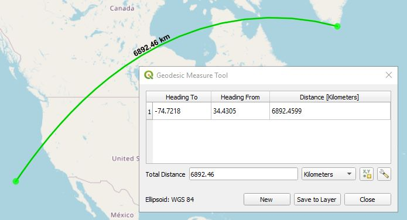

# QGIS Shape Tools Plugin

***Shape Tools*** has the following tools that are installed in the Vector menu or can be accessed from the toolbar.

*  **Create Shapes** processes a point vector layer to create ellipses, lines of bearing, pie wedge, polygons, stars, ellipse roses, hypocyloids, polyfoils, epicyloids, and hearts based on the table's fields and parameters from the dialog box. All use geodesic math to calculate the shapes. 
*  **XY to Line** uses pairs of coordinates from each layer's records to create geodesic lines in between. Geodesic lines represent the shortest path along the Earth's surface between two points. The input can be a point vector layer or a table layer that contains pairs of coordinates.
*  **Geodesic Line Break at -180,180** breaks lines at the international date line at -180,180 degrees longitude for a more pleasing visual look.
*  **Geodesic Shape Densifier** densifies a line or polygon vector layer by adding geodesic points inbetween each line segment whenever the distance between vertices exceeds a certain threshold. This creates a geodesic path that gives it a nice smooth curved appearance. If the vector layer is a line, it can also draw a geodesic line just between the beginning and ending points.
*  **Geodesic Measure Tool** provides geodesic line measuring, similar to that implemented in Google Earth.
*  **Azimuth, Distance Tool** digitizes points at an azimuth, and distance or creates a geodesic line from the point clicked to a point in the azimuth direction located at a certain distance

**Contents**

* [Create Shapes](#create-shapes)
* [XY to Line](#xy-to-line)
* [Geodesic Line Break](#geodesic-line-break)
* [Geodesic Densifier](#geodesic-shape-densifier)
* [Geodesic Measure Tool](#geodesic-measure)
* [Azimuth, Distance Tool](#azimuth-distance)
* [Settings](#settings)

##   Create Shapes

Ellipses, lines of bearing, pie wedges, multi-sided polygons, stars, ellipse roses, hypocycloids, polyfoils, epicycloids, and hearts can be created from parameters in the layer data or from default parameters in the *Create Shapes* tool. Note that the layer created is a memory layer and will not be saved with the QGIS project. You need to manually save the layer or use the [Memory Layer Saver](http://plugins.qgis.org/plugins/MemoryLayerSaver/) plugin.

The following are details for creating each shape. All of the shapes are created centered about the point or from the point. Common elements are:

* **Input points layer** - Select the desired points layer.
* **Output layer name** - Select a name for the output layer that will be created in QGIS as a memory layer.
* **Output CRS** - Specify the output layer's coordinate reference system (CRS). This can either be the same as that of the input layer, the same as the project CRS, or WGS 84. It defaults to the input layer's CRS.

### Ellipse

Select a points vector layer and an output layer name or use the default name. Then select the specific ellipse parameters. The semi-major axis of the ellipse runs along the orientation axis. The orientation the axis is measured in degrees in a clockwise direction from the north line. Units of measure for semi-major, and semi-minor lengths are defined by ***Axis units of measure***.

If a field in the layer represents the semi-major axis, semi-minor axis, or orientation of axis, then the field can be selected and the data from the layer will be used, otherwise the default values will be used.

### Line of Bearing

**Bearing** is the angle measured in degrees, in a clockwise direction from the north line. A **line of bearing** is the line drawn from a starting point in the direction of the **bearing** for the selected distance. The line of bearing uses geodesic math to find the shortest path and is accurate along the Earth's surface. 

### Pie Wedge

Depending on the **Azimuth mode**, if it is set to *Use beginning and ending azimuths*, then the pie wedge focal point starts at the point layer's geometry extending out to the specified radius. It starts at the **Starting azimuth** going in a clockwise direction to the **Ending azimuth**. If **Azimuth mode** is set to *Use center azimuth and width*, then a center azimuth is specified which becomes the center of the pie wedge with an arc length of **Azimuth width**. The pie wedge can either be defined from the point vector layer data fields or from the **Default** parameters. **Arc point spacing** determines the number of degrees in the arc before another point is added to give it a curved appearance. Making this smaller will give smoother results, but will be slower rendering the shapes.

### Polygon

Create an N-sided polygon centered on the vector point. The vertices of the polygon lie on a circle of the default radius.

### Star

Create an N-pointed star with the outer vertices located on a circle defined by the outer radius. The inner vertices are located along the circle defined by the inner radius. One of the radius' can be negative which gives an interesting shape.

### Ellipse Rose

Create an N-petal rose. The distance from the center to the outer petals are defined by the radius.

### Hypocycloid

Create an N-pointed hypocycloid. A hypocycloid is defained as the curve traced by a point on the circumference of a circle that is rolling on the interior of another circle. The distance from the center to the outer cusps are defined by the radius.

### Polyfoil

Create an N-leafed polyfoil. The distance from the center to the outer leafs are defined by the radius.

### Epicycloid

Create an N-leafed epicycloid. The distance form the center to the outer edge is defined by the radius.

### Heart

Create a mathematical heart which fits within the circle defined by its radius.

### Donut

Create a donut shape. The inner and outer radius is specified either as default values or from the attribute table. If the inner radius is 0 then a solid circle is drawn. **Arc point spacing (degrees)** defines how often a point is drawn to create the circle. A lower value will produce a smoother circle, but will take more time to draw.

##   XY to Line
This creates geodesic, great circle, or simple lines based on starting and ending coordinates in each table record. One of the coordinates can be from a point layer geometry or both can come from the table data itself where each record has a starting x-coordinate, starting y-coordinate, and an ending x-coordinate and ending y-coordinate.

**Input Layer** - This can either be a points layer, a simple table, or any other vector data set that has two coordinates among its data fields. For example a CSV file containing starting and ending coordinates could be imported using the importer ***Add Delimited Text Layer...*** from the menu ***Layer->Add Layer->Add Delimited Text Layer...*** From this dialog box the user can specify one of the coordinates for the layer's geometry or **No Geometry** can be used. Both types of layers will be visible to **XY to Line.**

**Output point layer** - Optional points layer that can be created in QGIS. It can contain the starting point, ending point, both points, or no points in which case it will not be created. 

**Output line layer** - Output line layer file that is created in QGIS.

**Input CRS for coordinates within the vector fields** - CRS of the input coordinates within the table data fields.

**Output layer CRS** - CRS of the output line and point layers.

**Line type** - 1) **Geodesic** creates a highly accurate shortest path between two points. 2) **Great Circle** creates a *Great Circle* arc between the two points. 3) **Simple Line** creates a non-geodesic straight line between the two points. 

**Starting point** - Specify whether to use the *Layer's point geometry* (not applicable for layers that don't have Point geometry) or to specify the **Starting X Field (lon)** and **Starting Y Field (lat)** from the layer's fields.

**Ending Point** - Specify whether to use the *Layer's geometry* (not applicable for layers that don't have Point geometry) or to specify the **Ending X Field (lon)** and **Ending Y Field (lat)** from the layer's fields.

**Show starting point** - If checked the output point layer will include an entry for the starting point if an **Output point layer** has been specified.

**Show ending point** - If checked the output point layer will include an entry for the ending point if an **Output point layer** has been specified.

**Break lines at -180, 180 boundary for better rendering** - Depending on the QGIS projection when lines cross the international date line, strange behavior may occur. Checking this box breaks the line at the -180, 180 boundary in a way that it displays properly.

This function can also be accessed from the **Processing Toolbox**.

##   Geodesic Line Break at -180,180

If you have ever created a geospatial masterpiece that has crossings across the international date line at a longitude of -180&deg;/180&deg; and had it turn out like the image on the left, you are not alone.

**Geodesic line break** will break lines at the -180&deg;/180&deg; boundary along a geodesic path which is the shortest distance along the earth's surface between two points. The algorithm is very simple with just an input and output layer. The resulting output is shown in the above right side image.

##   Geodesic Shape Densifier

Densify a line or polygon vector layer by adding geodesic points inbetween individual line segments when its length is too great. This gives it a nice smooth curved appearance. For line vectors a geodesic line can be drawn between just the beginning and ending points.

The distance between two points before adding additional vertices is set from the **Settings** menu.

* **Input Layer** - Select an existing line or polygon layer.
* **Output Layer Name** - Specifies the name of the memory layer that will be created in QGIS.
* **Discard inner vertices of the line vectors and just use end points** - When this is checked only the beginning and ending points are used when drawing geodesic lines.

The following shows the before and after results of running this function on a polygon layer.

This function can also be accessed from the **Processing Toolbox**.

##   Geodesic Measure Tool

This provides the ability to measure distances using geodesic (shortest path) algorithms. The results returned are the same as those used by Google Earth and makes for a nice baseline of distances. It also includes the heading from the first point to the second and a heading from the second point to the first. The units are in degrees. The units of distance can be meters, kilometers, feet, yards, miles, and nautical miles. Simply click on the ***Geodesic Measure Tool*** icon and start clicking on the map. 

The **Save to Layer** button will create a **Measurement** layer that contains the distance and by default the distance label will be displayed.

By right-mouse clicking on the **Measurement** layer and selecting **Open Attribute Table,** the following attributes are available for each measured line segment; label, value, units, heading_to, and heading_from.

##   Azimuth, Distance Tool

This tool works on point and line vector layers and is enabled when they are selected and in edit mode. In either case this dialog box is displayed when the tool is enabled and a point on the map is clicked on.

Azimuth is in degrees and distance is in the selected *Distance units of measure*. The following is how it interacts on point and line layers. 

* **Point Vector Layer** - If an editable point vector layer is selected and the map is click on, the tool will create a point in the azimuth direction and at the specified distance. The point clicked on can be also included in the output layer.
* **Line Vector Layer** - If an editable line vector layer is selected and the map is click on, the tool will create a geodesic line from the clicked point along the azimuth and distance path.

## Settings

The settings dialog box can be accessed from the Shape Tools menu *Vector->Shape Tools->Settings*. The following are the parameters that can be configured.

* **Try to guess column names** - By default the ellipse and line of bearing shapes will try to guess the vector fields that contain the appropriate parameters such as semi-major axis, semi-minor axis, axis orientation, bearing, and distance. If it finds one of the fields that has a name similar to these it will set the drop down menu to that item. If you do not want this behavior, then uncheck this box.
* **Geodesic Line Settings** - These are settings when drawing geodesic and great circle lines.
    * **Maximum segment length before creating a new segment** - In order to draw a smooth curved line, multiple line segments are required. This defines how far to travel before a new line segment is created. This parameter is in kilometers. 
    * **Maximum number of segments per line** - This is the maximum number of line segments that will be created for any line even though it may exceed the maximum segment length. This takes precedence.
* **Measure Tool Settings** - These are settings for the **Geodesic Measure Tool**.
    * **Azimuth Range** - The azimuth is displayed from **-180 to 180** degrees or from **0 to 360** degrees.
    * **Rubber band color** - Selects the rubber band line color used by the measure tool.
